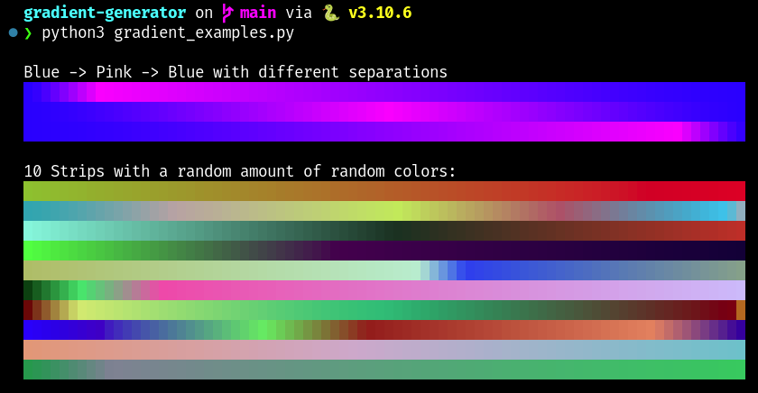

# Linear gradient generator


Generates gradients between N-dimensional points with a certain separation. Example application with RGB colors:



The first three were generated the following way:

```python
from gradient import Gradient

def example(length):
    colorA = (0, 0, 255)
    colorB = (255, 0, 255)

    gradients = [
        # one tenth A->B and 9 thenths B->A
        Gradient([colorA, colorB, colorA], [1, 9]),
        # 50/50 gradient, with B right in the middle
        Gradient([colorA, colorB, colorA], [1, 1]),
        # similar to the first one, with the lengths inverted
        Gradient([colorA, colorB, colorA], [9, 1]),
    ]

    print("Blue -> Pink -> Blue with different separations")
    for g in gradients:
        print_strip(g, length)
```

Take a look at `gradient.py` for the details on the API and at `gradient_examples.py` for usage examples.
